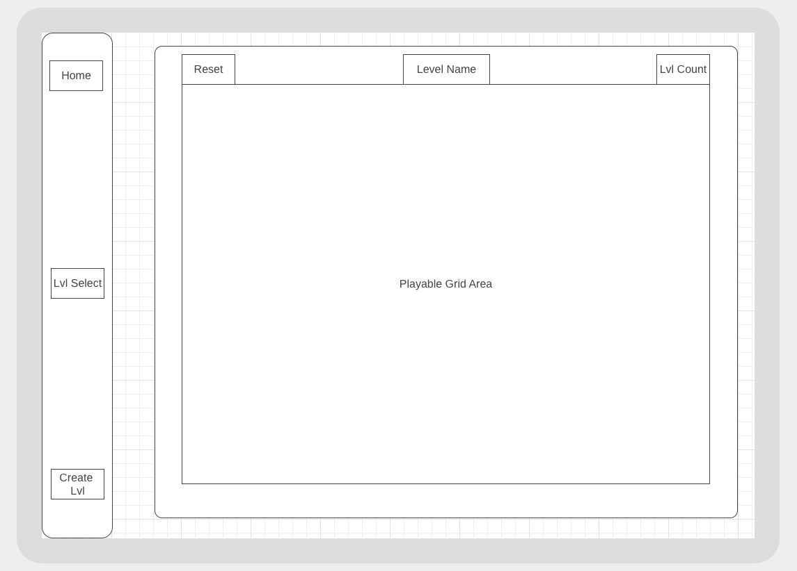
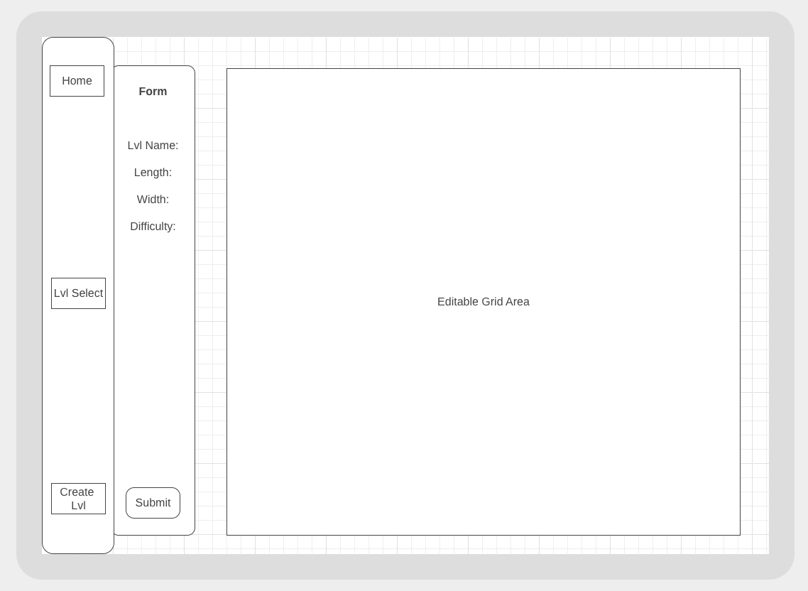
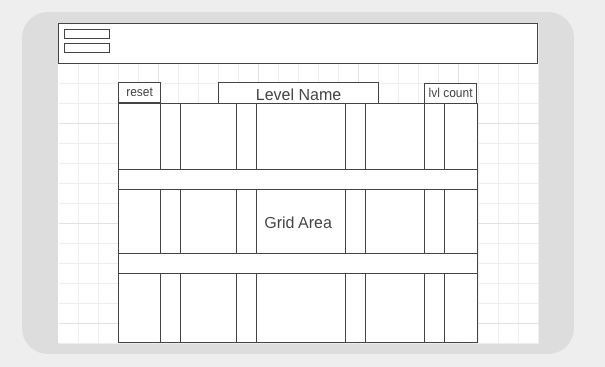
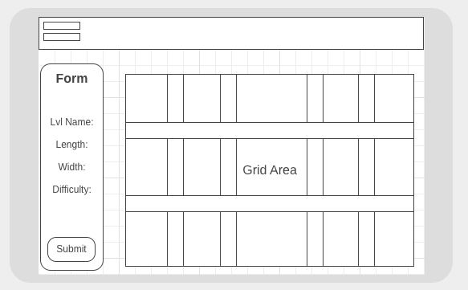

# Project Overview

## Project Name

IceBreaker

## Project Description

This grid-based mini-game allows users to play, browse and create levels stored in an airtable database. The goal of the game is to travel from point A to point B on a grid, touching each non-obstacle tile on the grid exactly once. Once a tile has been traversed, it cracks, meaning that traveling back to that tile will end the game.

## Wireframes

### Desktop

##### Homepage Wireframe


##### Level Select Wireframe


##### Level Editor Wireframe


### Tablet

#### Homepage Wireframe



#### Level Editor Wireframe



### Mobile

#### Homepage Wireframe



#### Level Editor Wireframe



## Component Hierarchy


## API and Data Sample

Below is a sample response from my airtable database, which tracks the author, level name, difficulty, width and height of the grid, and a stringified JSON representing the grid itself.

```json
  {
    "id": "recBnyry0RHP0wrVB",
      "fields": {
      "levelName": "Square One",
      "height": 3,
      "difficulty": "Easy",
      "width": 3,
      "author": "Beej",
      "grid": "[[0,2,1],[0,0,0],[1,3,0]]"
      },
    "createdTime": "2021-01-24T02:51:06.000Z"
  },
```

### MVP/PostMVP

#### MVP

- Home page with routes to respective pages
- Playable levels using on-click and/or keyboard controls
- Get and post level/level information from airtable

#### PostMVP

- Alert users if their custom level is unsolvable using a pathfinding algorithm.
- Ability to update existing levels
- Timer to track time to complete level
- Functionality to create levels of varying dimensions
- Option to generate random levels

## Project Schedule

| Day       | Deliverable                                        | Status      |
| --------- | -------------------------------------------------- | ----------- |
| Jan 20    | Proposal Approval / Airtable setup                 | Completed   |
| Jan 21    | Component Layout & Routing / Get, Set, & Post Data | Completed   |
| Jan 22    | Jan 21 cont'd / Basic CSS                          | Completed   |
| Jan 23    | Basic CSS / MVP                                    | Completed |
| Jan 24    | Post-MVP CSS                                       | Completed  |
| Jan 25-26 | Post-MVP functionality                             | Completed  |
| Jan 27    | Presentations                                      | Completed  |

## Timeframes

| Component                                     | Priority | Estimated Time | Time Invested | Actual Time |
| --------------------------------------------- | :------: | :------------: | :-----------: | :---------: |
| Proposal                                      |    H     |      3hrs      |     3hrs      |    3hrs     |
| Airtable Setup                                |    H     |      1hrs      |     1hrs      |    1hrs     |
| Basic Structure and Component Hierarchy       |    H     |      1hrs      |      1hr      |     1hr     |
| Navbar Navigation and Routing                 |    H     |      1hrs      |      1hr      |     1hr     |
| Basic CSS for Home                            |    H     |      3hrs      |        5hrs       |     5hrs        |
| Basic CSS for Lvl Select                      |    H     |      3hrs      |     3hrs      |    3hrs     |
| Basic CSS for Lvl Create                      |    H     |      3hrs      |      2hrs         |     2hrs        |
| GET / POST Airtable Data                      |    H     |      2hrs      |     3hrs      |    3hrs     |
| Logic for Reading Grid Layout From Airtable   |    H     |      2hrs      |        2hrs       |      2rs       |
| Making Grid Editable                          |    H     |      2hrs      |     3hrs      |    3hrs     |
| Logic for Traversing Grid / Playing Game      |    H     |      3hrs      |     6hrs      |    6hrs     |
| Logic for Win/Loss & Resetting                |    H     |      3hrs      |     2hrs      |    2hrs     |
| pMVP CSS                |    H     |      4hrs      |     7hrs      |    7hrs     |
| Total                                         |    H     |     31hrs      |       39hrs        |      39hrs       |

## SWOT Analysis

### Strengths:

I feel comfortable with the basics of using React, including functional components, common hooks like useState, useEffect, and useRef, as well as additonal dependencies like react-router-dom and react. Additionally, I ended up developing a good familiarity with the way data is passed from parent to child, child to parent, and sibling to sibling.

### Weaknesses:

Because we only had two weeks with React, there were multiple times where I'd approach a problem in the code that I wasn't quite sure how to overcome with the tools I had. My app needed a lot of communication between siblings, which is difficult without tools like Redux, useReducer, and useContext. I feel as though the logic of the game and my use of hooks 

### Opportunities:

This project forced me outside of my comfort zone both because I'd never written a game, and because I had to approach a lot of problems in my app that weren't directly transferable from lessons in class, since we didn't touch how to approach game logic or sibling to sibling communication.

### Threats:

I learned that after a certain point, I can become frustrated and overwhelmed if I feel like I need to learn a ton of new skills in order to solve a problem. I tried to rely on classmates and my squad lead, but there were often times where either my classmates were just as unsure as I was, and my squad lead was busy. As I become more familiar with React through repetition, review, and more projects, I'm confident that I'll become a more experienced React developer.
