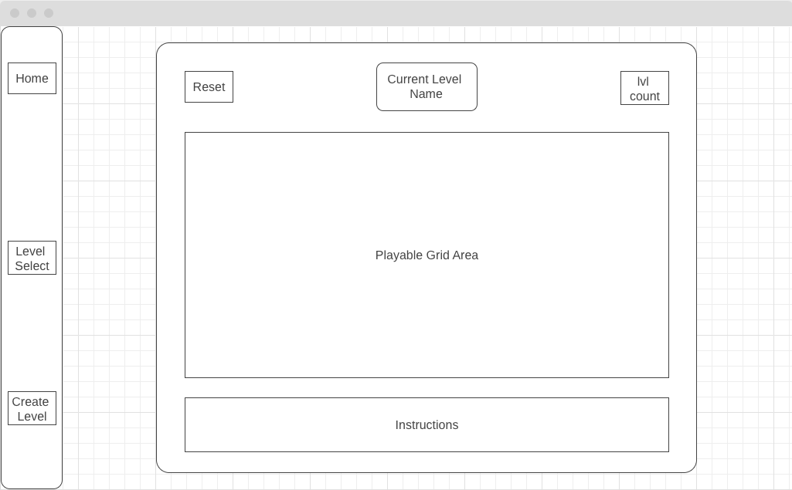
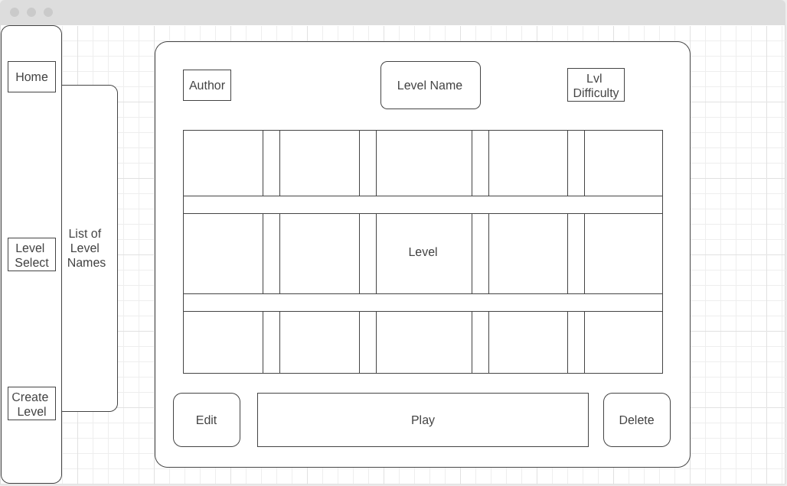
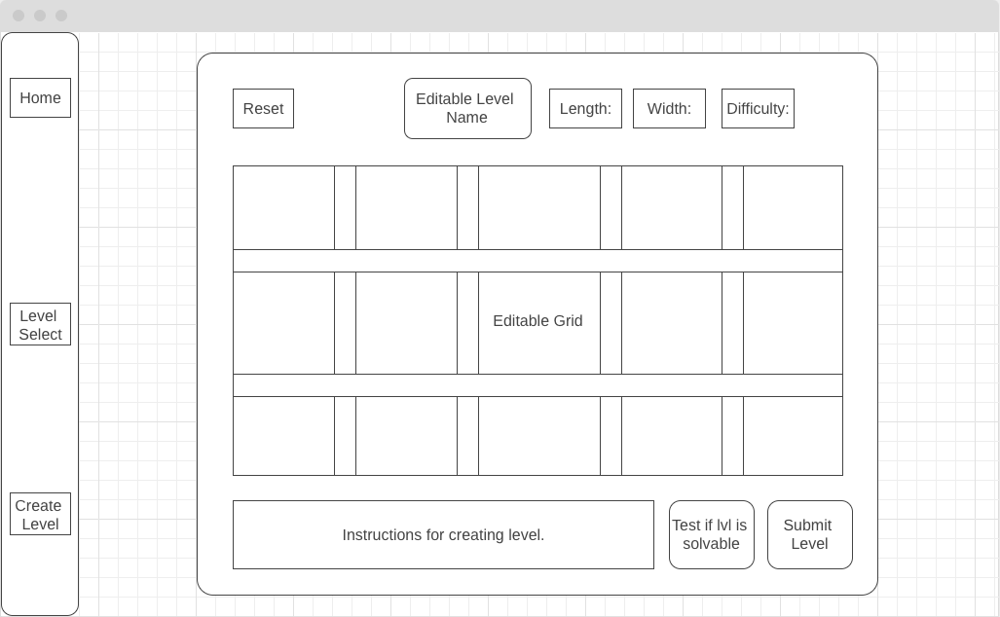
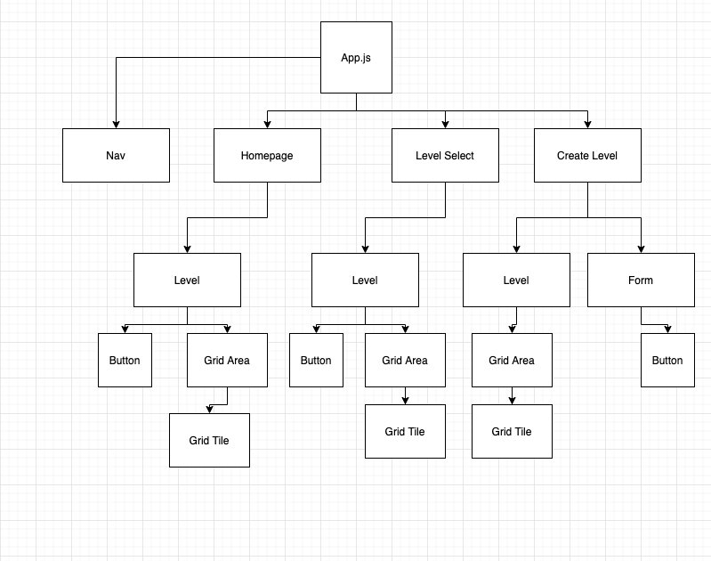

# Project Overview

## Project Name

IceBreaker
## Project Description

This full CRUD mini-game allows users to create, update, and play through levels from an airtable database. The goal of the game is to travel from point a to point b on a grid, touching each non-obstacle tile on the grid exactly once. 

## Wireframes

##### Homepage Wireframe


##### Level Select Wireframe


##### Level Editor Wireframe


## Component Hierarchy


## API and Data Sample

Below is a sample response from my airtable database.

```json
{
    "records": [
        {
            "id": "recHTS4vn7mZSI4MU",
            "fields": {
                "levelName": "Beginner Level",
                "height": 3,
                "difficulty": "easy",
                "author": "Beej",
                "width": 3,
                "grid": "{\"0\":{\"x\":0,\"y\":0,\"obstacle\":false},\"1\":{\"x\":1,\"y\":0,\"obstacle\":false},\"2\":{\"x\":2,\"y\":0,\"obstacle\":false},\"3\":{\"x\":0,\"y\":1,\"obstacle\":false},\"4\":{\"x\":..."
            },
            "createdTime": "2021-01-19T23:25:04.000Z"
        },
        {
            "id": "recltBhXxIz3eKb86",
            "fields": {},
            "createdTime": "2021-01-19T23:25:04.000Z"
        },
        {
            "id": "recidGJw7Y1u393cZ",
            "fields": {},
            "createdTime": "2021-01-19T23:25:04.000Z"
        }
    ],
    "offset": "recidGJw7Y1u393cZ"
}
```

### MVP/PostMVP
#### MVP 

- Home page with routes to respective pages
- Playable levels using on-click and/or keyboard controls
- Get and post level/level information from airtable

#### PostMVP  

- Alert users if their custom level is unsolvable using a pathfinding algorithm.
- Update existing levels
- Add timer to track time to complete level
- Add functionality to create levels of varying dimensions
- Add option to generate random levels

## Project Schedule

|  Day | Deliverable | Status
|---|---| ---|
|Jan 20| Proposal Approval / Airtable setup | Complete
|Jan 21| Component Layout & Routing / Get, Set, & Post Data | Incomplete
|Jan 22| Jan 21 cont'd / Basic CSS | Incomplete
|Jan 23| Basic CSS / MVP | Incomplete
|Jan 24| Post-MVP CSS  | Incomplete
|Jan 25-26| Post-MVP functionality | Incomplete
|Jan 27| Presentations | Incomplete

## Timeframes

Tell us how long you anticipate spending on each area of development. Be sure to consider how many hours a day you plan to be coding and how many days you have available until presentation day.

Time frames are also key in the development cycle.  You have limited time to code all parts of your app.  Your estimates can then be used to evalute possibilities based on time needed and the actual time you have before the app must be submitted. It's always best to pad the time by a few hours so that you account for the unknown so add an additional hour or two to each component to play it safe. Throughout your project, keep track of your Time Invested and Actual Time and update your README regularly.

| Component | Priority | Estimated Time | Time Invested | Actual Time |
| --- | :---: |  :---: | :---: | :---: |
| Adding Form | H | 3hrs| 3.5hrs | 3.5hrs |
| Working with API | H | 3hrs| 2.5hrs | 2.5hrs |
| Total | H | 6hrs| 5hrs | 5hrs |

## SWOT Analysis

### Strengths:

### Weaknesses:

### Opportunities:

### Threats:
